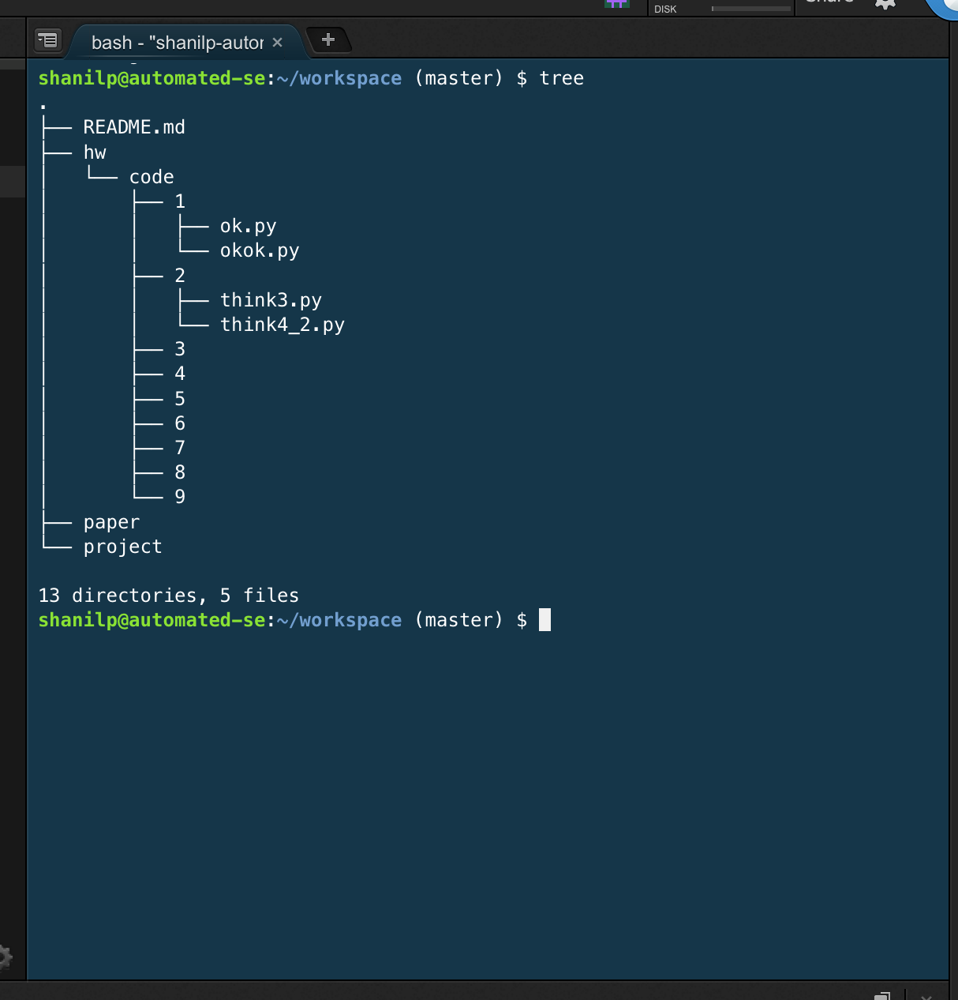
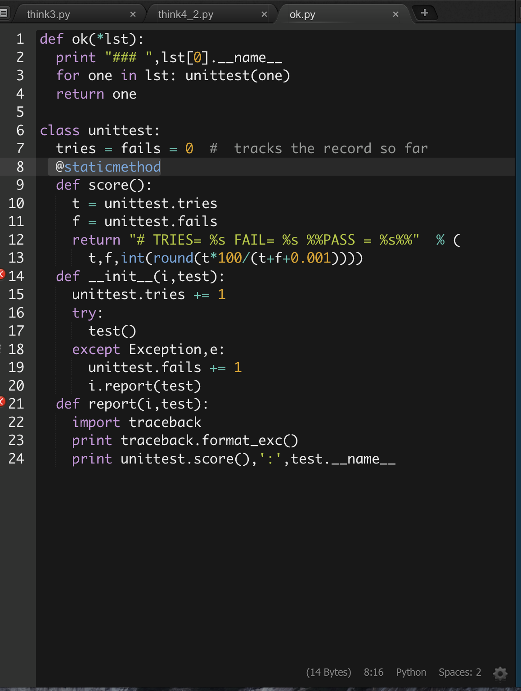
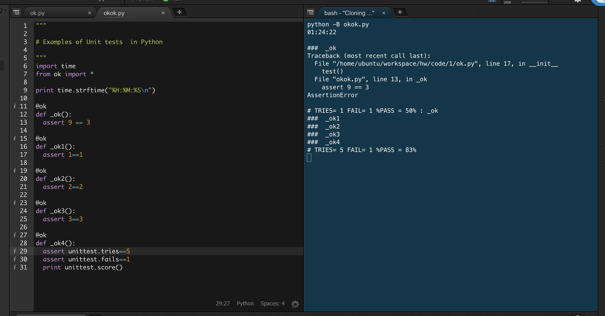

#Repository Tree:

#Python Version:
### Output for "python --version"

#Pip Help:
### Output for "pip help"

#Easy Install help:
###Output for "easy_install -h"

#Python IDE Syntax Highliting

#Running OkOk.py:

#Contributor:
Shanil Puri (spuri3)