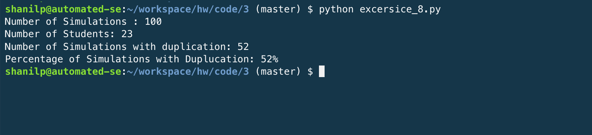
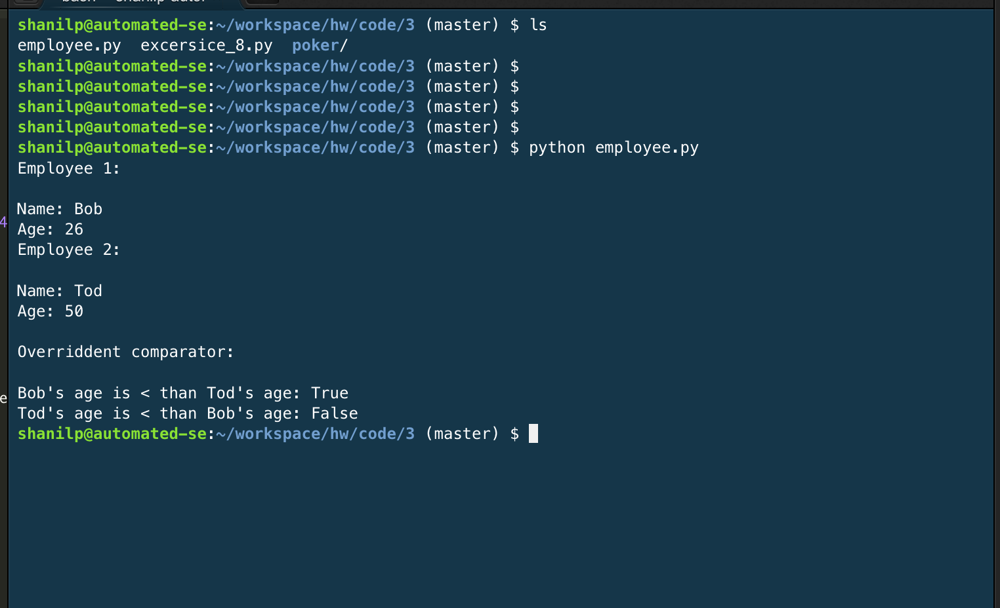
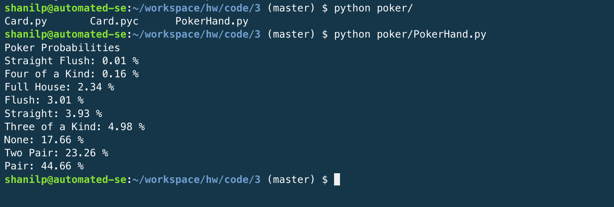

# Code 3
CSC 591- MASE Repository

Exercise 10.15_8 -  Output of the Birthday paradox
     
    

Exercise 2 -  Output of the Employee
     
    

Exercise 18.12 -  Output of the PokerHand program
     
    

## Collaborators:

* Shanil Puri