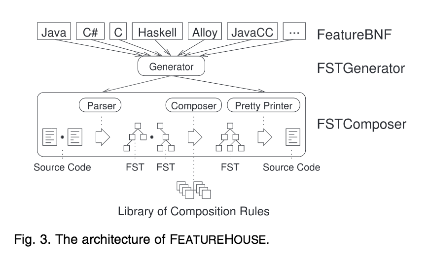

# Paper Summary
## i. Apel, Sven, Christian Kastner, and Christian Lengauer. "FEATUREHOUSE: Language-independent, automated software composition." Proceedings of the 31st International Conference on Software Engineering. IEEE Computer Society, 2009.

## ii. Keywords

1. **FEATUREHOUSE :** FEATUREHOUSE may be defined as a framework for software composition on the basis of superimposition into which new languages can be plugged on demand. In such a scenario the integration of a new languages would require the investment of only a small amount of time in contrast to manual implementations.

2. **Superimposition :** The process of composing software systems by merging the substructure of two or more software artifacts is known as Superimposition. In this process a software system is essentially designed using merging of substructures of software artifacts as compared to simply combining the software artifacts to prepare sofware systems. Eg: If two JAVA files named Foo with same named classes, were to be combined, the result would still would be called and all the internal functionalities of both the classes would be merged to have functionalities for both.

3. **Software Composition :** The process of composing software systems from the basic building blocks known as software artifacts is known as Software Compositions. The process essentially entails the use of modular blocks known as software artifacts which maybe combined to give different software systems depending upon the combination of software artifacts used.

4. **Feature structure tree :** A feature structure tree represents the essential modular structure of a software artifact and abstracts from language-specific details. An FST acomplishes this by the use of nodes to represent Language-specific charecteristics.

## iii. Artifacts

1. **Motivation:** While there are various tools that support superimposition for code artifacts and non-code artifacts, they appear all different, are dedicated to and embedded differently in their respective host languages, and their implementation and integration requires a major effort. The authors of this paper propose a method to automate the above procedures called FEATUREHOUSE. Using the FEATUREHOUSE technique proposed by the authors new language integration would only take a few short hours of investment as compared to setting up manually. They have proposed the use of attribute grammar to achieve automation of integraton of additional languages.

2. **Visualization:** 

The above figure has been used by the author to demonstrate the steps undertaken for the construction of the novel toolset the authors have named: FEATUREHOUSE-FSTGENERATOR

3. **Data:** 
In section 4, the author introduced 8 case studies. The LOC of these cases ranged from 300 to about 60,000. Also, the programming language were from JavaCC, Haskell, C to un-coding language, e.g. XML, text.	
    
4. **Futiure Work:** 
The authors have proposed to further evaluate an XML based schema which may in the future play the role of FEATUREBNF. The authors also suggest the investigation of further methods to better support for XML based languages into the markup.

## iv. Possible Improvements

1. Similar studies have been made for language specific methods for automated software composition, even though this is the first of its kind cross language composition framework. It would be give a better understanding of the performance of a cross language composition tool wrt to language specific tools to see the benefits that this tool may have or if any over head the use of this tool may entail.

2. FEATUREBNF, one of the most important concepts presented in this paper, has not been formally defined by the authors. It is left to the interpretation of the reader what an extremely important part of the framework and a formal definition of the same by the authors would provide better understanding of the concept.

3. All results are listed as a table in the paper. To help reader understand the result, the author can use visualization techniques, such as histogram graph, x-tile, etc.
